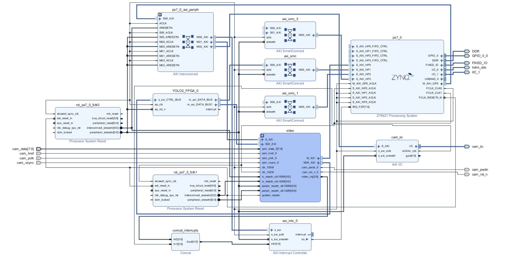

# YOLO_PYNQ

Based on [yolov2_xilinx_fpga](https://github.com/dhm2013724/yolov2_xilinx_fpga) by 陈辰, this project implements the deployment of **yolov2-tiny** on the Zhengdian Yuanzhi Linghangzhe **ZYNQ_7020** board. Features such as **photo capture**, **weight switching**, and **auto start** have been added. (Due to limited resources on the board, the **photo capture** and **weight switching** features cannot be implemented for the full **YOLOv2**, and are instead supported using **yolov2_tiny**.)

## Environment

Development board: Zhengdian Yuanzhi Linghangzhe **ZYNQ_7020**  
Project part: **xc7z020clg400-2**  
Vivado version: **2018.3**

## Instructions

### Development Board Model

- Other development boards such as **PYNQ_Z2** may be used, but it's recommended to choose a **pynq** series board with sufficient resources.  
The camera used is **ov5640**.  
- If a different board model is used, modifications to the XDC file in the Vivado project and the device addresses in the board files are required.  
- For **PYNQ_Z2**, you can refer to the project [PYNQ-YOLOv2](https://github.com/qing-2/PYNQ-YOLOv2) by **qing-2**, which uses the **YOLOv2** model.

### Training and Quantization

- Training is done using **darknet**, see [software_version](https://github.com/dhm2013724/yolov2_xilinx_fpga/tree/flex/software_version), using the **int16** version.  
- If the network architecture needs to be modified, specify the desired structure during training and update the definitions accordingly during quantization.

    Quantization for **yolov2_tiny** can be found in **software\software_version_yolov2_tiny**.

### **HLS** Simulation

HLS files are located at [src_int16](https://github.com/dhm2013724/yolov2_xilinx_fpga/tree/flex/hls/src_int16), using the **int16** version. A float32 version can also be used for faster simulation, as int16 simulation is time-consuming.

### **Vivado** Design

The project files are located at **Vivado\yolov2_ov5640_hdmi_zdyz7020**.  
Two physical buttons are added to control photo capture and weight switching.

**Block_Design**  

### Board Deployment

Board-related files are based on **PYNQ**. Two weight models are used: one trained on the **COCO** dataset for common object detection, and another trained for **skin disease** classification (with poor performance, included for demonstration purposes only).  

- **Weight Switching**  
  Controlled via two PL buttons, which update the model weights during runtime.

- **Auto Start**  
  The **PYNQ** series runs a **Linux** kernel, so you only need to add a startup service.

  - **command.txt** — commands to enable and disable the startup service  
  - **pynq_yolo.service** — the systemd service file  
  - **yolov2_tiny.py** — the Python task executed on the board  
  - **start_yolov2_tiny.sh** — the startup script

## TODO

- [ ] Dynamic Network Structure Switching  
The hardware structure is not hardcoded in the bitstream, so the network structure can also be dynamically switched. However, the **YOLOv2** network, when quantized to int16, is difficult to fit on the **ZYNQ_7020** board. Therefore, this feature is only experimental.
