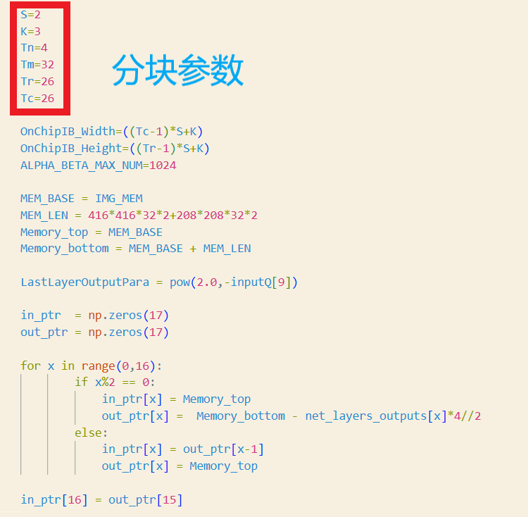
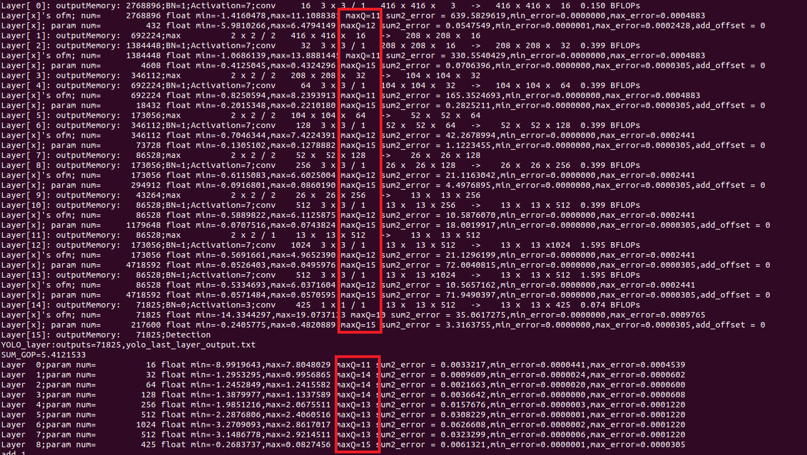

# Reorganize/Reorder Weights and Quantize Weights and Biases

This folder is about how to reorganize YOLOv2_tiny's weights, and quantize weights and biases from float32 to fixed16. (The number of biases is too small, and we can load each layer's biases just once before the computing phase.)

First, just copy two files(weights.bin and bias.bin) here from step 1.

Then, __make gen_i16; ./test_layers or ./test_layers ../test_imgs/dog.jpg__ This step will generate reorganized weight file(16bit) and some related cfg files.

Last, __make test_i16; ./test_layers__ (The last layer's output is generated from the functon __forward_region_layer__) in yolov2.h. Check the result, and you can turn to hls/src_int16 for hls design. __Dont need to copy any file.

__Note__: If you need to modify the network architecture, you should update the network structure definitions and layer descriptions in __yolov2_acc_sim.h__.  

The corresponding structure definitions in the board file __yolov2_tiny.ipynb__ also need to be modified.

Make sure the block parameters (in __hw_params_gen.py__) are consistent with the board driver files.

Modify the quantization parameters as needed according to different weights.  

